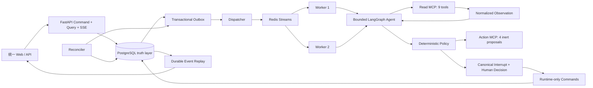

# SupportGuard v1.5.12 Architecture

> **v2.0 Authority Notice（2026-08-11）**：当前唯一的新工作权威是
> `docs/interview-edition-simplification-v2.0.md`，操作宪法是根目录 `AGENTS.md`。用户已授权
> Phase 0～7；Phase 0～6 已完成。Phase 7 首个 Candidate `b132c395c2edf2d7d72477dc9051bffc3d7f4024` 的一次性 IE-P16 为 `11/16`；replacement `7527c0acca079f57549538e49135a91ef87b9389` 的前置证明和 Hosted CI 全绿，但一次性 IE-P16 为 `13/16`。两个 SHA 均已消费且不得重跑；用户已持续授权后续 clean Candidate 的必要真实 DeepSeek 验证。当前 Interview Head 为 `i202_refund_fence_authority`，Phase 7 与最终 Definition of Done 仍未完成。
> 精简前基线固定为 `6255c8c0eb0dcedd877bfbf16a9695dad2a0c9eb`。下方
> 2026-07-28 的“当前”表述是不可改写的精简前架构状态，不覆盖 v2.0。

状态说明（2026-07-28）：当前唯一实施权威是 `docs/real-user-journey-integrity-corrective-v1.5.12.md`，并继承 v1.5.11～v1.5 与 v1.2 的非冲突安全边界。v1.5.9 在原有 Runtime Provenance、MCP、RAG、HITL、Conversation 和可靠异步链上收口高风险 Action；v1.5.10 把已验证的“资源不存在或当前不可执行”事实收敛为零 Proposal、零 Approval、零 Action 的确定性客户答复；v1.5.11 只完成不可变 Receipt 的离线语义裁决。v1.5.12 不重跑这些已消费验收，而是修复真实用户巡检暴露的 Approval 资源身份与生命周期、同资源动作去重、Ticket FIFO 调度、可信 Action State、多轮上下文和产品体验闭环。Evaluation v6 保持 `active_dataset=null`，本轮不读取 Holdout，也不实现 Cross-Encoder。

## Conversation-first 产品层（v1.5）

Web 不再把最新 Run 投影成一张“工单结果页”。`SupportTicket` 继续作为聚合根和兼容身份，`ConversationTurn` 串联每次客户输入、稳定 `run_id`、客户可见 Message、Citation 与 Action；旧 `final_response` 仅保留兼容投影。首条消息在一个事务中创建 Conversation、Customer Message 与 Turn，后续普通 Turn 由每 Conversation 串行调度，而 Approval Resume 仍恢复原 Run 和原 Action。

客户查询只读取 PostgreSQL typed projection；Redis 仅负责队列和 SSE 唤醒。默认页面只展示自然语言消息、聚合来源和安全 Action Card，技术检查器按需读取持久化 Decision、MCP Observation、Policy、Action Admission、有限 Obligation 状态与 actual runtime provenance，且不暴露 Prompt、CoT、Secret、客户原文或原始不可信 Payload。Tenant 与 Principal 由服务端 Session 解析，切换 Tenant 会中止旧请求和 Stream，并清空旧投影。

历史 v1.2.x Gate、Parity 与 invocation eight 均不属于当前发布路径。当前完成状态只由 v1.5.12 Requirement、同一候选上的实际命令和最终 Verification 共同决定；冻结 Matrix 或测试退出码不能替代 Journey Evidence。

## 产品读模型与 Web 边界

v1.4/v1.4.1 在不改变异步命令链和 Runtime Action 权限的前提下补齐独立 Query Plane；v1.5 在同一边界内增加 Conversation Projection。FastAPI 只通过冻结 API Capability 中的只读函数解析 Principal、Session Context、Conversation、Turn、Run 与 Approval Detail。Query 不创建 Run、MCP 调用、Proposal 或 BusinessAction。

Development Cookie 只用于本地演示，Production Web 使用 OIDC Bearer Adapter；Tenant / Customer 始终由服务端 Membership 与 Scope 派生。`principal-resolution.v2` 返回当前用户、Active Tenant、Customer、Subscription 与审批者可访问 Tenant，所有 Tenant 摘要使用同一个 typed contract。客户页面消费面向任务的投影，内部 Event / Hash 默认折叠。

Ticket Aggregate 以最新 Run 为当前回答边界。Knowledge Source 必须能从该 Run 的 Material Claim 反向关联到 Citation Binding、Context Membership、Chunk、Document Version、Index Version、Supporting Span、Source Locator 和有效时间；任意搜索候选不能直接冒充引用。业务事实只取该 Run 的终态 Observation，并展示工具、状态、`observed_at`、source refs 与 freshness。历史 Run 只保留在明确标记的 Timeline。

Provider 显示分为 `configured_runtime` 与 `actual_runtime`：前者是命令受理配置，后者只从该 Run 已持久化的 LLM Attempt/Context Ledger 派生；尚未调用时为 null，Fake、DeepSeek production/native 不混淆。Context Evidence Projection 使用版本化合同：历史 Ledger 按 `context-evidence.v1` 重放，新 Ledger 使用只向模型暴露 source locator 的 `context-evidence.v2`；发布校验按 Ledger 版本重放，不改写历史事实。最终引用集合由 Material Claim 的真实绑定确定，未知绑定继续 fail closed。

当前 `agent-contract.v5.2` 在原有 Schema 上增加有界的 `supportguard_greeting` 语义，
并将 Provider 终态提交建模为无 I/O、无权限的严格结构化响应通道。MCP Runtime 的默认调用
上限为 30 秒，以覆盖 Runtime-only 镜像中本地 E5 查询模型的有界冷启动；故障合同仍可注入更短
上限验证超时、重连和 fail-closed。
独立 [`conversation_semantics.py`](../backend/src/supportguard/agent/conversation_semantics.py)
把无事实问候与知识型 API 定义从实时账户诊断中分开：问候不调用工具、不制造引用；
知识型 API 问题只暴露 `search_knowledge`，只有明确需要当前状态时才开放账户、用量或
Trace Read Tool。[`freshness.py`](../backend/src/supportguard/agent/freshness.py) 只裁剪绑定
到过期业务 Observation 的 Claim，并在剩余知识证据足够时重新计算终态。

Product List/Detail 使用 Pydantic Response Model，并为 Message、Timeline、Evidence/Fact 返回明确 limit、`has_more` 与 cursor 元数据。PostgreSQL 与 SQLite Projection 共享响应模型合同。前端详情请求使用 Abort + generation，Mutation 在结果不确定时复用同一 Idempotency Key，角色切换只在新 Session 成功后提交。

客户展示语义由 [`conversation_presentation.py`](../backend/src/supportguard/api/conversation_presentation.py)
集中处理：首条消息只有问候时，详情以首个实际问题作为展示标题；与最新 Turn 绑定的
`executed` Action 显示为“操作已完成”。前端只把详情投影同步到当前侧栏项，不从聊天文本
推断业务状态，也不改变数据库权威事实。

浏览器异步收敛采用 `PostgreSQL AgentEvent truth + Tenant/Ticket Redis Pub/Sub wake-up + <=1s polling fallback`。Redis 只缩短等待，不承载游标或业务真相；丢失通知或短暂离线时，前端保留 SSE 生命周期并从最后 Ticket Sequence 重连补放。`awaiting_approval` 是 Interrupt 中间态而非 Ticket 终态，客户页继续收敛；独立审批后的 Action/Final Outcome 不要求 Reload。Nginx 使用 Docker DNS 动态解析 API，API 容器地址变化后不要求重建 Frontend。

数据库当前 Head `b207c0a1d001` 继承 b202 的窄检索终态：上下文“旧版本”追问与
Compare 语义对齐；无锚点 Historical 只有在拒答原因、Temporal Selector 以及全部空候选
字段严格一致时，才允许从 Trace 起始态安全结束。该修复不扩大 Read、Action 或 Runtime
权限。b203 只让有界客户事件 Reader 返回稳定 Durable Event ID，使 API、SSE Cursor 与
断线恢复去重拥有同一可追溯身份；b204 将该身份补齐到工单详情与技术检查器 Timeline，
完成公共 Event DTO 的生产者闭包；b205 统一 List/Detail 的 Pending Approval 客户短状态词；
b206 令详情 Capability 在构造 JSON 前按 Cursor/Limit 选择 Turn，并在同一结果中投影 Citation；
原始 Payload、Event Hash 和内部 Trace 仍保持隐藏。

## v1.5.12 Action、审批与失败投影

`ApprovalRequest` 是唯一动作聚合根，并持久化 Canonical Resource Identity；同一
Tenant/Customer/Action/Resource 最多保留一个 `pending` 或 `approved` 申请。所有页面、
Agent Context 和 Memory 都从只读 `ConversationActionStateV1` 投影状态，不从聊天文本或
旧 Summary 猜测。`verification_pending` 表示外部效果或数据库提交结果暂时无法权威确认：
原 Approval 保持 Active，重复动作被拦截，Reconciler 只能在业务资源和 BusinessAction
共同提供权威事实后收敛到一个终态。

审批详情使用严格安全 DTO。Review Context 展示原始诉求、客户安全业务事实、
Evidence/Freshness、Policy、动作 Diff 和执行前置条件；审批来源仅允许同租户审批者读取与
该 Approval 绑定、按时间排序的最多 `100` 条客户/助手消息，并标出原始 Turn、返回数量和
是否截断。Raw Review Context、Hash、内部错误、Secret 与不可信 Payload 没有公开字段。

所有公开 HTTP 错误统一为
`ProductProblem(public_code, message, retryable, request_id)`。运行失败进一步只公开
`api_request`、`provider`、`tool`、`runtime` 四类，并用固定五段式说明已检查内容、
已确认事实、未知部分及原因、是否创建审批/执行变更和可执行下一步。Nginx HTML、Provider
原始错误体、MCP Raw Error 和内部错误码只能留在脱敏内部边界。

当前产品不实现 Operator Inbox、坐席分配、人工回复、Resolve 或 SLA。新审批决定、技术
失败和恢复路径都不得生成 `manual_takeover`；历史行只投影成
`manual_takeover_legacy`，明确表示自动处理已停止且当前没有人工坐席闭环。

## 异步主链

API Transaction 同时提交 Domain、Idempotency、RuntimeJob、Outbox 与 Audit，然后返回 `202`。Worker 只在 PostgreSQL 结果持久化后 `XACK`。Redis 不保存业务真相；Flush 后 Reconciler 从 PostgreSQL 重建 Delivery。

## Agent 与能力边界

一次客户消息对应稳定 `run_id`。Graph 的真实循环是 `AgentDecision → Read Tool Call → Runtime Scope / Schema 校验 → MCP → Observation 持久化 → Replan / Stop`，最多两轮。Provider / MCP 每次外发前由 Attempt Ledger 原子消费预算；Retry、Redelivery 和 Approval Resume 不重置预算。

高风险 Action 在同一个 Graph 外壳内使用 `ActionAdmissionV2 → ActionSpec → ActionObligationLedger`。Admission 只从已接受且已脱敏的客户消息、模型分类计划和服务端身份重建，模型计划本身没有权限。Ledger 只接受当前 `run_id`、同 Tenant/Customer/Scope、同 Resource、满足 Freshness 和版本规则的 Observation；每次 Decision 只注入仍未满足义务对应的 Read Tool。读取全部合格后不再回到带 Tool 的 AgentDecision，而是预留最后一次 LLM Call 执行 `tools=[]` 的严格 Evidence Synthesis。Provider 只输出回答以及每条 Claim 选择的 Citation / Observation Source；Runtime 先按当前 Context Membership 拒绝未知或跨命名空间引用，再确定性派生 Locator、Chunk 与顶层引用并集，形成内部 `BoundEvidenceSynthesis`。统一 `proposal_assembler.py` 最后从 Admission、Ledger 与 ActionSpec 组装三类 Typed Proposal。

`ActionSpec v2` 同时声明有限的 Terminal Business Outcome 规则。若当前 Run 的同作用域、同资源、未过期 Read Observation 已证明账单已退款、Key 已撤销、订阅状态不可变更、目标值无变化或已发布能力不支持该目标，Ledger 进入 `terminal → explain_terminal`，而不是把 nullable 字段当作缺失证据。通用 `explain_terminal_business_outcome` 节点使用纯函数 Renderer 生成客户答复，随后仍经过 Policy 与 Finalizer；模型不会再次猜测结论。Outcome 保存 Observation ID、Content Hash、Scope Hash、Resource Version 与 Source IDs，客户消息只发布 FinalResponse 实际引用的 Source，技术检查器展示稳定 Outcome Code 和来源数量。Wrong Scope、Forbidden、Timeout、Stale、Wrong Resource 和冲突仍分别走原有 Failure、Retry/Clarification 或 Conflict 边界。

纯决策边界分别位于 [`action_specs.py`](../backend/src/supportguard/agent/action_specs.py)、[`obligations.py`](../backend/src/supportguard/agent/obligations.py)、[`tool_policy.py`](../backend/src/supportguard/agent/tool_policy.py) 和 [`proposal_assembler.py`](../backend/src/supportguard/agent/proposal_assembler.py)；[`graph.py`](../backend/src/supportguard/agent/graph.py) 是唯一 Composition Root，Decision、Read Loop、Action Flow、Approval 和 Finalization 的 I/O 编排由 `agent/nodes/` 下对应 owner 实现。旧的三条 `_canonicalize_requested_*` 动作专用分支已删除，新增 Action 行为只能扩展 Registry/Validator，不能在 Graph 中再造一条工作流。

HTTP 层由 [`routes.py`](../backend/src/supportguard/api/routes.py) 仅按原顺序聚合 `api/endpoints/`；Pydantic 公共合同、Scope Dependency 与安全读模型投影分别只有 `contracts.py`、`dependencies.py` 和 `projections.py` 一个 owner。事务层的 [`segments.py`](../backend/src/supportguard/services/segments.py) 只组合 Dispatch、Approval Resume、Finalization、Recovery 与公共锁域 owner，不复制 Fence、CAS、Idempotency 或 Effect-once 实现。前端 [`App.tsx`](../frontend/src/App.tsx) 只拥有 Session 与顶层 Route，Conversation 状态集中于唯一 `useConversationController`，展示拆为 Thread、Composer、ActionCard 与 Sources；`useTicketStream.ts` 仍是唯一 SSE/轮询恢复实现。

| 边界 | 能力 | 禁止 |
| --- | --- | --- |
| LLM | 分类、Read Tool Call、候选回答 / 提案 | Proposal / Runtime Tool、Tenant、批准、执行 |
| Read MCP | 9 个作用域内事实 / RAG Tool | 写表和高风险动作 |
| Action MCP | Escalation 与 3 类 inert Draft Proposal | Read Tool、Action 执行 |
| Policy | 选择 answer / clarify / reject / HITL | 接受 Prompt 改写规则 |
| Runtime | Fence、Snapshot、Resume、effect-once Action | 绕过审批与版本重校验 |

## Checkpoint、HITL 与 effect-once

Worker 收敛同时要求容器健康和当前两个容器身份各自发布的 PostgreSQL `ready` Heartbeat；健康
探针不能代替权威 Runtime Readiness。故障载体在同一 180 秒总预算内先等待容器启动，再等待
两条身份、Timing Version 与 Runtime Config Hash 均匹配的 Heartbeat，避免初始化尚未完成时
产生假绿。

每个 Job 使用 `run/job/fence` 私有 Checkpoint Thread。Segment Marker 记录 prepared → checkpoint_written → finalized / aborted；只有 Finalized Checkpoint 能推进 Canonical Pointer。高风险 Proposal 在 Finalize 前不可操作，Finalize 原子绑定 Approval、Action Hash、资源版本与 Canonical Interrupt。

Read Tool 节点采用“Observation 事务先于 Graph 节点 Checkpoint”的耐久恢复协议。Worker 若在同一
Tool Turn 部分提交后退出，新 Fence 接管时会把旧 `executing` Invocation 恢复为可执行状态，
校验并回放已经终态化的 Observation，只为未完成 ordinal 分配下一个尚未消耗的 Transport
Ordinal。已提交 Observation 不重复调用 MCP；未知发送仍消耗预算；每个逻辑调用最多两个物理
发送。若预算已耗尽，Runtime 写入稳定失败/取消 Observation 并安全停止。LangGraph 从 Checkpoint
中已经挂起的节点自然续跑，不使用 `goto` 重复调度同一副作用节点。

Human Decision 是持久异步命令。Resume 后不重新调用 LLM。Production Worker 先在同一事务通过 Scope Capability 重验 Approver Membership，再调用只接收 `approval_id + human_decision_id + job_id + fencing_token` 的 Runtime Action Capability；后者从持久 Revision 派生目标，原子校验 Tenant、Fence、Kill Switch、Action/Decision Hash、资源版本和 Plan Policy，完成退款、Key 撤销或配额调整。Worker 对三张业务资源表仍无直接 mutation 权限。`tenant + action_type + resource_id + resource_version` 唯一约束吸收重复 Delivery / 双击 / 崩溃恢复，deferred commit guard 则拒绝缺失 HumanDecision 或 canonical event 绑定的成功 Action。

`action-admission.v1` 的 Proposal 前旧 Checkpoint 不会被直接信任或重新规划。只有 Redacted Message、Classification、服务端 Scope，以及当前 Run 的唯一同资源有效 Observation 能重新证明完整绑定时，Runtime 才重建 v2 Admission 与 Ledger；否则稳定 fail closed，且不新增 LLM Call、Tool Call、Proposal、Approval 或 Action。已经进入 `await_human_approval` 的旧 Checkpoint 则沿原 Snapshot/Resume 路径继续，不退回 Agent Loop。

## Data、RLS 与身份

PostgreSQL 16 + pgvector 承担业务事实、Checkpoint、RAG、Outbox 与 Audit。每个 API / MCP / Graph 业务事务使用 `SET LOCAL app.tenant_id / principal_id / principal_role`；RLS 是应用 Filter 之外的第二道防线。Production 只接受 Issuer / Audience / JWKS / exp 校验通过且具有本地 Membership 的 OIDC Bearer Token；Development Cookie 模式被显式标记。

当前数据库头为 `b207c0a1d001`。Reader-first 的兼容升级主链与安全边界不变；b206 将 Conversation Page 的 Turn、Message、Run 与 Citation 限定在当前页面内并以一次 Capability 返回，b207 只追加审批来源的 Origin 有界 Keyset 分页与问候标题的同事务持久化。Reject/Edit 与全部事务安全条件不变，所有不一致继续 fail closed。Inspector 只返回当前客户可见的有界事件、精确消息绑定引用和已脱敏运行状态，不返回 Prompt、Secret、Raw Payload 或 Runtime 原始错误；审批来源只允许当前租户审批者读取与该审批绑定的最新有界窗口，并只能继续向 Origin 之前分页。业务事实引用携带稳定 Source ID 和业务版本，前端按稳定身份去重并在知识与实时事实同时存在时保留两类证据。ApprovalRequest 使用显式 Canonical Resource Identity，数据库只允许同租户、客户、动作和资源存在一个 Active Approval；RuntimeJob 持有 Ticket 与单调 Dispatch Sequence，并以 Ticket 级 Leased Lane 保证新消息与 Approval Resume 串行。Worker Readiness 是能力事实而非静态标签：Canonical Runtime Manifest、Provider/Limiter、两个 MCP Session/Schema/Generation、消费进度与 Migration Head 任一不满足都会发布 `degraded`，PostgreSQL 控制面再把有界组件事实聚合到内部依赖快照。Heartbeat Capability 的持久类型和受限角色 `__healthcheck__` 投影统一为 JSONB，避免数据库健康探针因 `json/jsonb` 隐式转换失败。Approval Queue 由 Pending-first 的有界轻量 Projection 提供，终态历史不会挤掉待审批项。`SupportTicket.last_message_at` 只由客户可见 Message 单调推进，Conversation List、Cursor 和产品 `updated_at` 使用同一活动时间；Reconciler、Job/Run、Legacy Ticket 状态与内部审计更新不能重新排序对话。`evidence_freshness_insufficient` 会形成独立的 `answered_limited` 客户结果，Activity、Turn 和 Inspector 保留同一限制语义。受限 Read MCP 的政策检索只要求当前租户/客户存在订阅记录，不把 `active` 状态误当成知识读取授权；因此失效订阅仍能获得可追溯的资格解释。固定 SQL Capability 会把 `KnowledgeDocument.document_type` 与 Chunk 一起投影，使 Obligation Ledger 能在受限 PostgreSQL 路径中校验权威文档类型；Policy、审批、Runtime-only Action 和写权限继续 fail closed。四张 Conversation 控制面表保持 RLS enabled、非 FORCE：生产 API/Worker/MCP 登录仍必须携带与写入行完全一致的 `app.tenant_id`，跨租户消息写先由 Trigger 返回稳定的 `tenant_scope_mismatch`，再由 RLS 保持独立的 fail-closed 防线；只有明确的非生产 bootstrap owner 能执行跨租户维护。Message、Turn、Run、Approval 与 Withdrawal 引用均使用真实同租户复合外键，不能靠字符串 ID 越过租户边界。

b200 不改变上述状态机，只撤销 b199 重建内部实现函数时误恢复的 Reconciler 角色
`EXECUTE`，使运行时继续只能通过冻结的外层 `supportguard_reconciler_prepare` 能力进入。

## v1.2.6 稳定正确性边界

- `RequestContext`、`ControlPlaneContext`、`WorkerExecutionContext` 与 MCP Envelope 分离；Context 负责携带可信身份，Repository、MCP 和事务仍重新授权。
- ToolInvocation/TurnGroup/Observation 的持久模型按 ordinal、Attempt、Transport 和唯一终态约束 Replan；Worker takeover 必须沿用逻辑调用身份并取得新的 Executor Fence，不能改写 Origin Lineage。
- Graph 以 non-canonical State / Domain Delta 和 `FinalizerPayloadV2` 约束 canonical 写入；Finalizer、Publication 和 Approval Resume 都重新验证 actual head、来源 lineage 与当前执行 Fence。
- AgentEvent 使用冻结 Envelope/Canonicalization Version、`ticket_sequence`、`previous_event_id`、parent hash、correlation / causation 形成完整链；REST、SSE 与 Resume 只使用 Ticket Cursor。Retention 不逐条删除 AgentEvent，避免破坏链头验证。
- RAG ingestion 保存 canonical source bytes、半开 UTF-8 byte range、不可变 Origin Lineage、复合 Snapshot/Pipeline 身份与 Context Membership；Publication 只发布 terminal-ok Trace 的 exact ok Observation，并在不重新检索的前提下重验 Eligibility。
- ContextLedger 一对一绑定实际 Provider Attempt。敏感 Context 只保存 request hash、token count、脱敏 component manifest 与规则版本，不保存可逆 Provider Body；第三次 Provider Payload 的两轮回归确保前两轮 Observation 各出现一次。ProviderMaterialClaim 只能选择本轮 Citation Binding 或业务 Observation Source；Locator Hash、Chunk ID 和聚合引用由 Runtime 从 Context Membership 确定性绑定，不能由模型创造或重复抄写，并由固定模板渲染用户答案。
- Memory 仅由 fenced Finalizer 在 canonical run 完成后写入，并绑定 source run、checkpoint hash、event watermark、freshness 与 expiry；历史 Observation 不作为当前业务真相。
- 当前语料清单为 14 份异构 Markdown、159,603 UTF-8 字节；干净 Demo 的 active E5 snapshot 为 14 份文档 / 215 chunks。Source bytes、Ingest Run、Index Version、Pipeline Fingerprint 与 Citation Binding 均可追溯。
- v6 Contract、公开 Dev 60、Scorer、Materializer、Lineage/Non-leak Audit 与 Custodian Packet 已建立；实现进程不持有私有 Holdout 明文。缺少独立 Custodian Receipt 时所有正式 Dev/Real 路由在 artifact access 前关闭。
- Cross-Encoder 尚未实现且默认关闭。只有 v6 独立冻结后才允许实现查询时联合推理并对冻结 Dev A/B；RRF 不是 Reranker。

这些是继承的稳定架构合同，不是一次历史 Gate 的当前通过声明。v1.2.6 Evidence 只保留其
历史结论；v1.5.12 是否完成必须由同一新候选上的真实 Role/Process/Protocol Observation、
逐 Requirement Journey Evidence、最终 Verification 与用户 Review Gate 共同判定，不能重跑
历史 Gate 或 invocation eight。

## Bounded Formal 与 Journey Acceptance

v1.5.10 的 Bounded Formal 原始结果永久为 `11/12`；v1.5.11 只针对同一不可变 Receipt
完成离线语义裁决 `12/12`，且 `provider_rerun=false`。它们证明有限终态合同，不证明
完整用户旅程。

v1.5.12 另行冻结 `23` 条 Journey、`37` 个原子子场景，其中 `19` 个包含真实
Production/Native Provider 语义、`18` 个为纯确定性验证。Matrix SHA-256 是
`f07f2ba30f4a84d871f6b645b278d9b403470dfd67b0fd76b56dc3923dbc8e34`，Evidence
Manifest SHA-256 是
`275f13a82433e9a3d076f1d9f78fecc9c6fc13a3896dc66fc706794a0fabf3cd`。当前
`candidate_sha=null`、`execution_state=unexecuted`；这些字段描述不回写结果的冻结输入，
不能单独证明 `37/37`。重构后 Candidate `e68715f...` 已在同一 clean pushed SHA 的八条
前置 Lane 全绿后，使用 exact 37-scenario registry 恰好执行一次，并由仓库外 Receipt
独立验证为 `37/37`；这仍不是独立 Holdout 或最终泛化能力声明。

这八条前置 Lane 由仓库内
`supportguard.acceptance.journey_preflight_contract_v1512` 唯一声明，而不是运行者
手写 Allowlist。Preflight 绑定 clean `HEAD == origin/main`、固定 Matrix/Manifest Hash、
命令与可执行文件身份、候选镜像 ID/Revision、容器 `CODE_VERSION`、服务拓扑、Readiness
和数据库 Head；即使启动、命令或载体校验失败，也必须先写出有限证据，再在 `finally`
删除本次拥有的 Container、Network、Volume、Image、Buildx 和临时目录并证明零残留。
其中 19 条 Playwright 只读检查访问真实候选栈且禁止 API Mock/Agent 消息，因此不会消费
Provider 或 37 项 Formal Journey 授权。

## 部署单元

Compose 拆分 postgres、redis、migrate、bootstrap-demo、api、dispatcher、reconciler、worker×2 与静态 frontend。Backend / Frontend 非 root、只读根文件系统、`no-new-privileges`；迁移和 Seed 不在多副本 Runtime 启动中执行。组件 Heartbeat 绑定当前 RuntimeTiming Snapshot 写 PostgreSQL；Public Ready 只返回 `ready`、`read_only` 或 `unavailable`，受 Internal Token 保护的依赖接口才返回详细状态。

v1.5.12 采用 Reader-first 的 `b179 → b180 → b181 → b182` 分阶段升级。先部署同一
Compatible Reader：它在四个 Head 上只读取各代已有的列，b179 缺少持久 Identity 时仅从
同租户绑定 Proposal 构造明确标记为 incomplete 的兼容投影，绝不从 Action Payload 猜身份。
在 b179、b180 和 b181 上，新 Binary 的 API Mutation 统一返回稳定
`503 upgrade_in_progress`；Worker、Dispatcher、Reconciler 与独立 Action MCP 使用各自
受限 Heartbeat Capability 读取实际 Head，并在 Provider、MCP、Redis 消费或任何写循环前
失败关闭。Readiness 在这些阶段明确返回 `read_only`，而不是把无 Worker 冒充故障。

b180 的内部名称 `expand-dual-write` 描述数据库兼容代，不表示新 Writer 获得写权限：
短暂共存的旧 Binary 仍可按旧列形状写入，Identity Trigger 会从权威 Proposal/Run 绑定补齐
新列；b181 完成严格 Backfill 后继续只读。旧 Worker、Fresh Heartbeat、Lease 和数据库连接
全部排空，b182 才安装最终 Capability/约束并允许新 Writer 启动。Heartbeat 同时记录实际
Database Head、Reader Contract、Writer Contract Generation 和
`writer_binary:v1512-double-write.v1`；Schema 名称、进程能力与真实写权限不会混称。

b182 的 Ticket 状态不是某个子 Job 或 Approval 的最后写入值，而是统一 Owner Capability
在同一 Ticket 锁内派生的工作流投影。每条终态路径先收敛自身 Run/Turn/Job/Approval，
再原子激活最早的 `accepted` Turn，最后按 `queued/running → verification_pending →
active approval → caller terminal` 的优先级投影 Ticket。这样一个被拒绝、撤回、执行或
失败的动作不会遮蔽同一 Ticket 上仍有效的另一项审批或后续消息。Reconciler Candidate
使用同一投影规则，已经正确收敛的历史终态不会被反复选中；SQLite 的确定性回退实现复用
相同的 `activate → converge` 顺序，但生产 PostgreSQL 写入仍只允许受限 Owner Capability。

Backend 只有 API 服务声明共享镜像 Build，其他 one-shot/Runtime 服务复用同一 tag。Dockerfile 将依赖、固定 revision 的 E5 下载、项目安装和源码复制分层。正式候选通过具名 Compose Project 与具名 Buildx Builder 构建，Backend/Frontend 镜像同时写入 OCI revision，Backend Runtime 的 `CODE_VERSION` 与该 Commit 一致；普通交互式开发仍可复用已有镜像。`scripts/demo_environment.py` 固定 `worker=2` 的演示拓扑，并对 Project、Builder、Cache、镜像和 Volume 使用可推导所有权与 exact-name 二次确认。`cleanup-build` 只移除该 Project 派生的两个临时镜像与 Builder Cache，不执行全局 prune。

PostgreSQL、Redis、API、Frontend 和可选 Tempo 的 Host 端口默认只绑定 `127.0.0.1`；容器内部服务仍通过 Compose Network 通信。Development Auth 只用于这个 Loopback Demo，Production 启动会拒绝 Development Auth 和默认 Credential。所有 Compose 服务使用 `json-file` 日志并限制为 `10m × 3`，避免本地验收无限放大 Docker Desktop 稀疏磁盘。

Redis 只承担可重建投递与限流，PostgreSQL 负责权威状态。普通 `XADD` 不再使用 `MAXLEN`；维护 Trim 对每条 Delivery 同时验证 PostgreSQL Job 终态、全部 Consumer Group PEL 无引用和统一 10 分钟保留窗口，删除后写入 `QueueDeliveryAudit`。Job max age、Admission backlog age、Reconciler 和 Readiness 共享 `runtime-thresholds.v1` Settings。API 与 Worker 的 Lua 只获得脚本内部实际命令；Dispatcher、Reconciler、Worker、Maintenance、API 使用互相隔离的 ACL。
